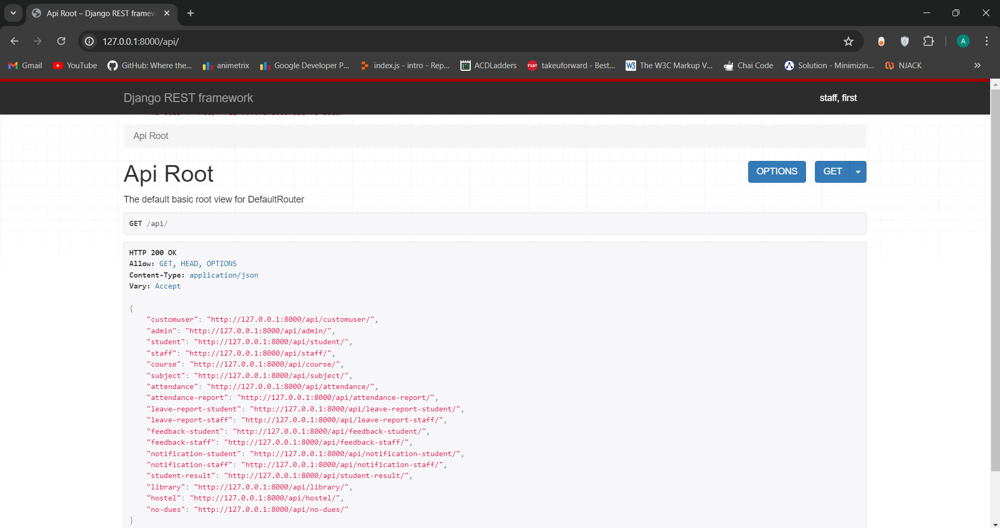
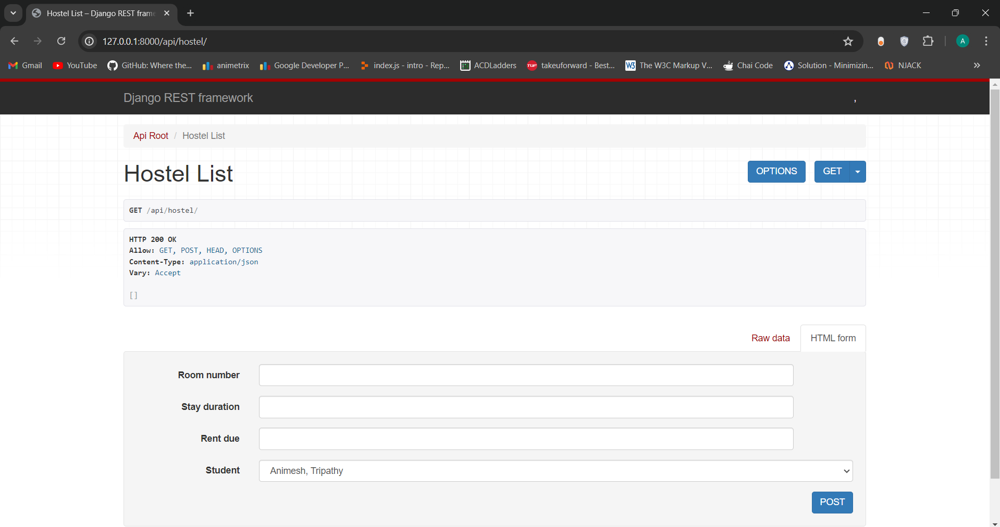
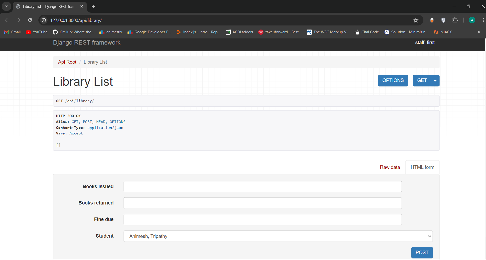
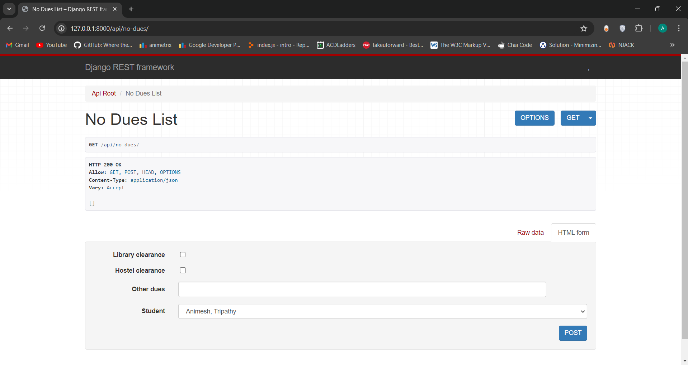
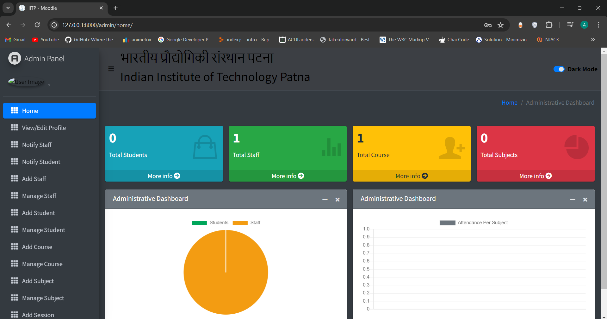
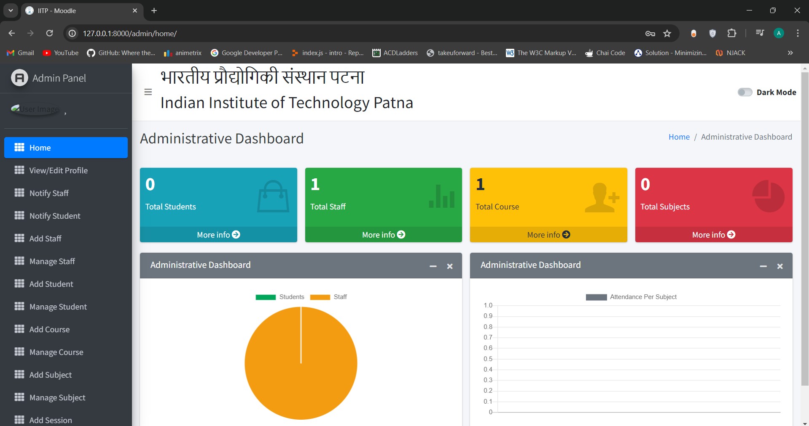
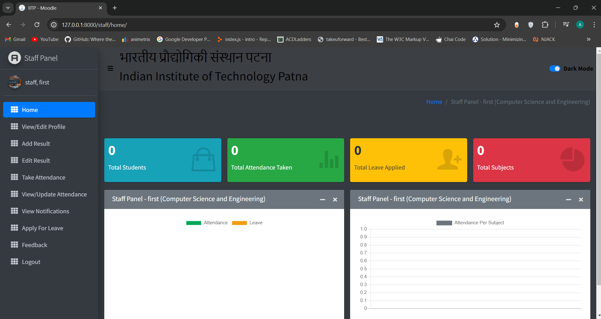
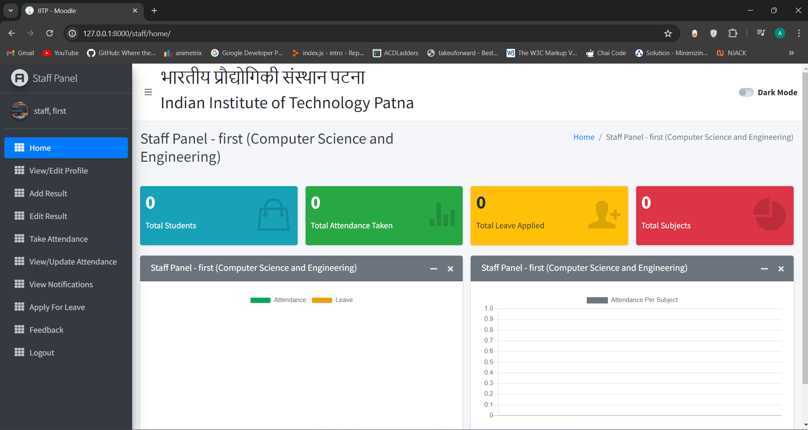
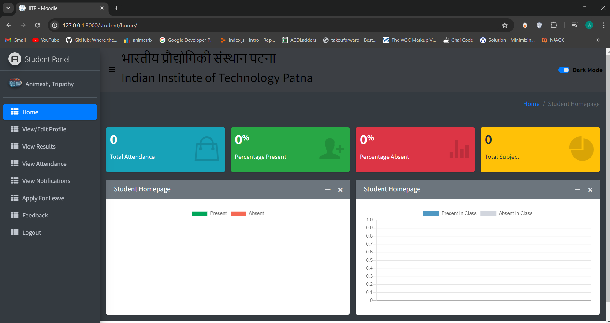
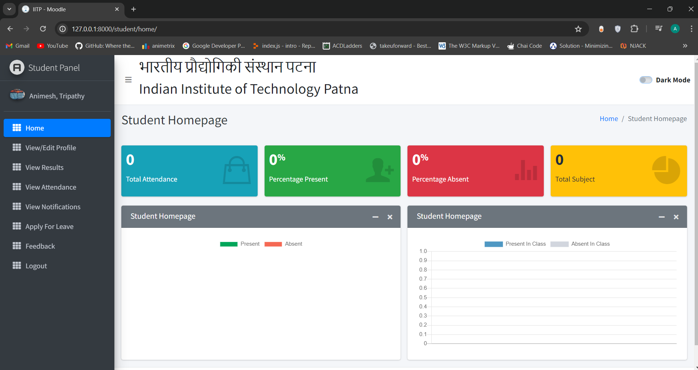

# Student Management Portal

This is a robust Student Management Portal developed using Django. It provides a comprehensive solution for managing students, staff, courses, and attendance. The system is designed to be user-friendly and efficient, making it easy for administrators, teachers, and students to access and manage information.

## Ongoing Development
Currently working on REST APIs to provide data to other systems like library management, hostel management, No dues management, etc.

[Front-end Template](http://adminlte.io "Admin LTE.io")

## Passport/Images
Images are from [Unsplash](https://unsplash.com)

### A. Capabilities for Admin Users
1. Access comprehensive summary charts showcasing student performance, staff performance, course statistics, subject details, leave records, and more.
2. Handle staff management tasks, including adding, updating, and removing staff members.
3. Oversee student management by adding, updating, and deleting student records.
4. Administer courses with options to add, update, and delete courses.
5. Manage subjects by adding, updating, and deleting subject information.
6. Supervise session management, including the ability to add, update, and delete sessions.
7. Monitor student attendance records.
8. Review and respond to feedback from students and staff.
9. Approve or reject leave applications submitted by students and staff.
10. **API Permissions**: Full access to all APIs for CRUD operations on all resources.
11. **Access Details**: Admin users have unrestricted access to all features and data within the system.

### B. Capabilities for Staff/Teachers
1. Access summary charts that provide insights into their students' performance, subjects, and leave status.
2. Record and update student attendance.
3. Enter and modify student results.
4. Submit leave applications.
5. Send feedback to the Head of Department (HOD).
6. **API Permissions**: CRUD operations on student data via APIs. Read-only access to other APIs.
7. **Access Details**: Staff members can manage student-related data and have limited access to other features and data.

### C. Capabilities for Students
1. View summary charts related to their attendance, subjects, and leave status.
2. Check their attendance records.
3. Access their academic results.
4. Apply for leave.
5. Send feedback to the Head of Department (HOD).
6. **API Permissions**: Read-only access to their own data via APIs.
7. **Access Details**: Students can view their own data and interact with limited features within the system.

### Future Scope: Full-Fledged College Management Portal
1. **Integration with Financial Systems**: Incorporate functionalities for fee management, scholarship tracking, and financial aid distribution.
2. **Alumni Management**: Develop features for alumni engagement, networking, and donation management.
3. **Event Management**: Add capabilities for event planning, scheduling, and registration for academic and extracurricular activities.
4. **Placement Cell**: Introduce modules for managing campus placements, career counseling, and internship opportunities.

## How to Install and Run this project?

### Pre-Requisites:
1. Install Git Version Control
2. Install Python Latest Version
3. Install Pip (Package Manager)

### Installation
1. **Create a Folder where you want to save the project**

2. **Create a Virtual Environment and Activate**

   Install Virtual Environment First
   ```sh
   $  pip install virtualenv
   ```

   Create Virtual Environment
   ```sh
   $  python -m venv venv
   ```

   Activate Virtual Environment
   ```sh
   $  source venv/bin/activate
   ```

3. **Clone this project**
   ```
   $  git clone https://github.com/AAnimeshTripathy/Student-Management-Portal.git
   ```

   Then, Enter the project
   ```sh
   $  cd student-management-using-django
   ```

4. **Install Requirements from 'requirements.txt'**
   ```sh
   $  pip3 install -r requirements.txt
   ```

5. **Add the hosts**
   - Go to settings.py file 
   - On allowed hosts, Use **[]** as your host.
   ```python
   ALLOWED_HOSTS = []
   ```

6. **Run Server**
   ```sh
   $ python manage.py runserver
   ```

7. **Login Credentials**

   Create Super User (HOD)
   ```sh
   $  python manage.py createsuperuser
   ```

   Then Add Email and Password

## Screenshots

### APIs

#### List of APIs


#### Hostel Management APIs


#### Library Management APIs


#### No Dues Management APIs


### Admin Dashboard

#### Dark Mode


#### Light Mode


### Staff Dashboard

#### Dark Mode


#### Light Mode


### Student Dashboard

#### Dark Mode


#### Light Mode
